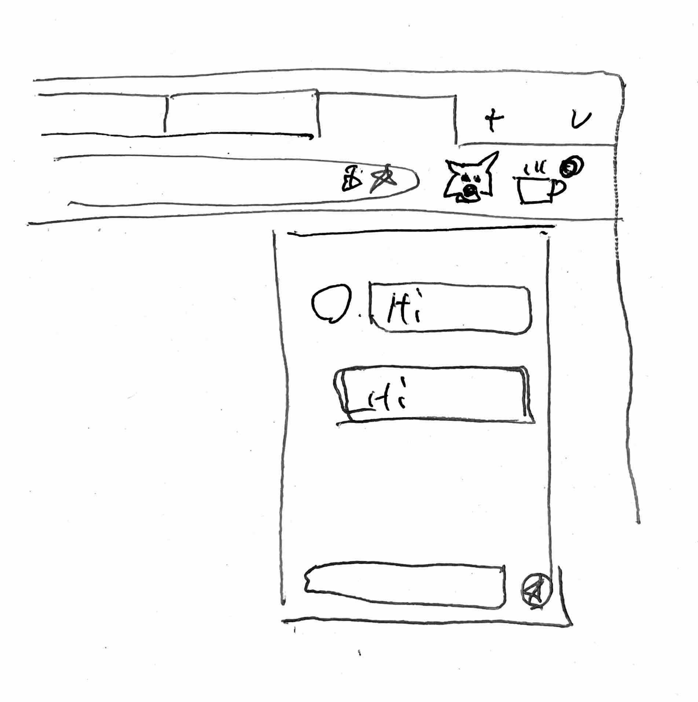

## EthPRESSO

EthPRESSO is messaging/notification layer for evm-address.
Initial release is a Chrome extension works with metamask.

### Problem it is solving

- Announcement for (specific) dapp user from builder. e.g.) "Your vault is about to expired, action required."
- Report bug/hacking risk to builder(builder address is published) without telling social profile. The reporter will receive bug bounty funds directlly.
- User can even complete money transfers through the familiar Telegram like UI.

### Technologies

- Offchain message data stored in supabase db with pgcrypto. (or gun.js)
- Sign-In with Ethereum is an authentication standard (EIP-4361)
- Onchain data indexed by thagraph

### Polygonscan links of smart contracts

- TBD

### Challenges faced

- Adopt lens protocol https://github.com/aave/lens-protocol
- (Adopt polygon id if documents are open)
- Add some contract related feature
